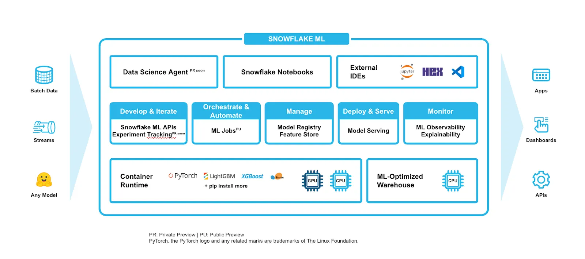
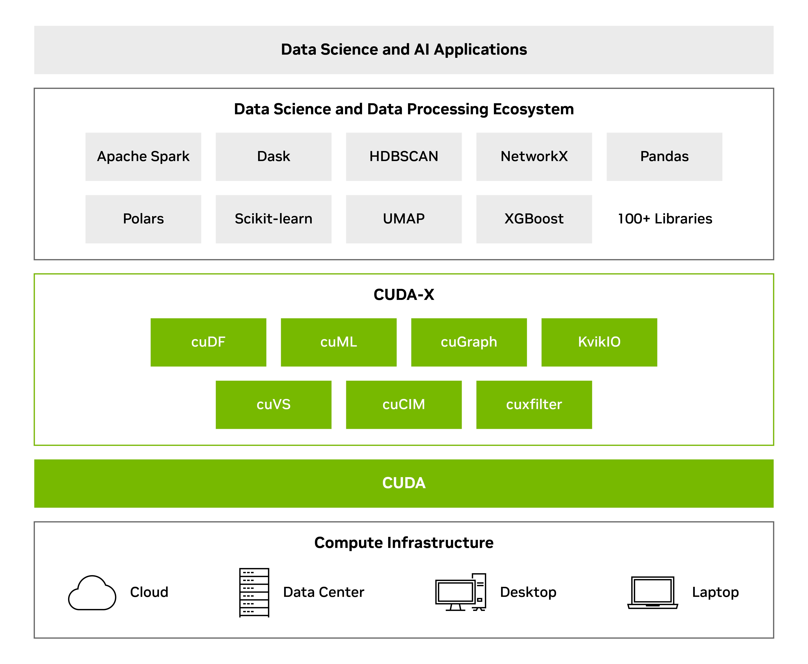
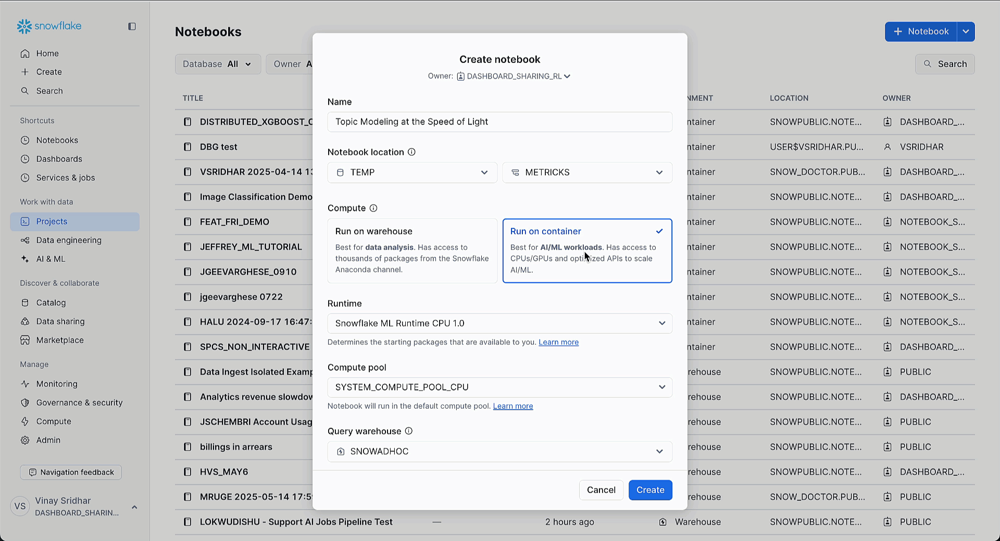
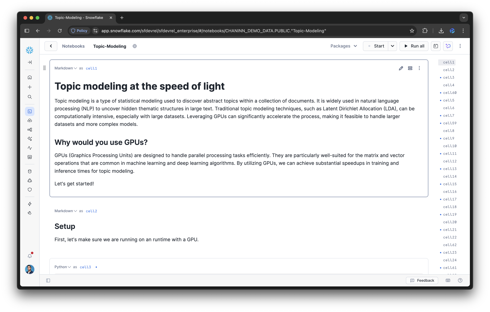
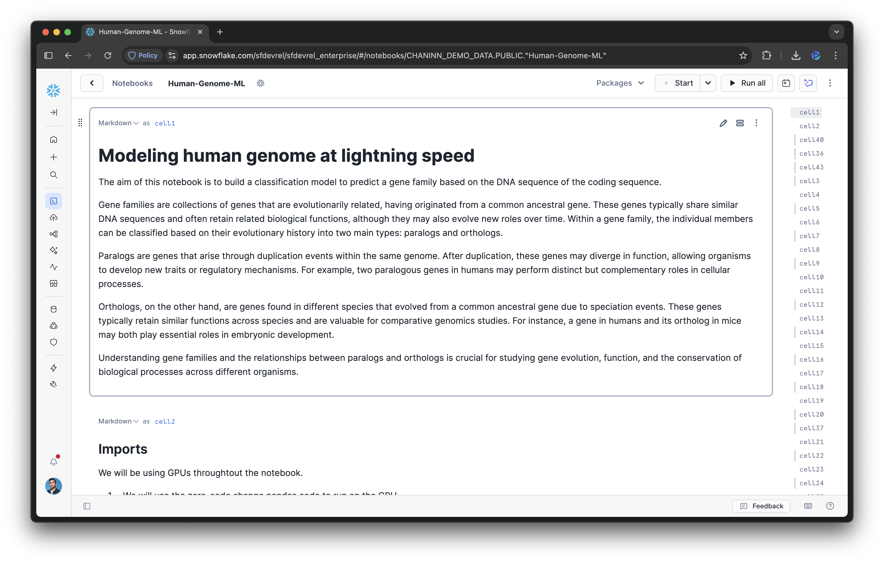

author: Nick Becker, Vinay Sridhar, Tom Drabas, Jenn Yonemitsu
id: accelerating-ml-with-nvidia-in-snowflake
summary: This guide covers how to use NVIDIA's cuML and cuDF libraries, now pre-installed in Snowflake ML, to accelerate scikit-learn and pandas workflows with zero code changes.
categories: featured, data-science, getting-started
environments: web
status: Published
feedback link: https://github.com/Snowflake-Labs/sfguides/issues
tags: Snowflake, Machine Learning, Python, NVIDIA, GPU, scikit-learn, pandas

# Accelerating Machine Learning in Snowflake with NVIDIA CUDA-X Libraries
## Overview
Duration: 5

As datasets continue to grow, GPU acceleration has become critical for machine learning workflows to avoid long wait times that can reduce productivity and increase costs. To address this, Snowflake ML has integrated NVIDIA’s cuML and cuDF libraries to provide significant performance boosts for popular ML algorithms. 

Briefly, Snowflake ML is an integrated set of tools and services that enables end-to-end machine learning workflows directly within the Snowflake Data Cloud. It allows data scientists and developers to build, train, and deploy ML models at scale without moving data out of their governed environment. Snowflake ML now integrates NVIDIA’s cuML and cuDF libraries via the Container Runtime, accelerating ML algorithms like scikit-learn and pandas on GPUs. This simplifies development with a pre-built GPU environment that includes libraries as part of the NVIDIA CUDA-X Data Science ecosystem and offers easy access to various GPU instances. This powerful solution helps Snowflake customers tackle large datasets in areas like topic modeling and genomics, boosting efficiency for computationally demanding tasks.



These libraries are part of the NVIDIA CUDA-X Data Science ecosystem, an open-source suite of GPU-accelerated tools designed to speed up data processing pipelines.

NVIDIA CUDA-X is a collection of open-source, GPU-accelerated libraries and tools designed to speed up data processing pipelines. It is designed to accelerate applications across a wide range of domains, including high-performance computing (HPC), data science, and artificial intelligence. The CUDA-X libraries provide highly optimized, GPU-accelerated implementations for various workloads, such as linear algebra (cuBLAS), deep learning primitives (cuDNN), and data processing (RAPIDS). By offering a comprehensive ecosystem of accelerated libraries, CUDA-X makes it easier for developers to harness the power of NVIDIA GPUs for their applications.



This guide will walk you through how to leverage this native integration in Snowflake. You will learn how to accelerate model development cycles for libraries like scikit-learn and pandas with no code changes required, turning processing times from hours into minutes. We will explore two practical examples—topic modeling and genomics—to demonstrate how these integrated libraries make it fast and seamless to work with large datasets in Snowflake ML.

### What You'll Learn
- How to set up a Snowflake Notebook to use GPU-enabled compute instances.
- How to enable NVIDIA's cuML and cuDF libraries to accelerate existing Python code.
- How to accelerate a topic modeling workflow using pandas, UMAP, and HDBSCAN on GPUs.
- How to accelerate a genomics classification workflow using scikit-learn and XGBoost on GPUs.

### What You'll Build
You will build and execute two GPU-accelerated machine learning projects in a Snowflake Notebook:
- A topic modeling pipeline that processes 500,000 book reviews in under a minute.
- A genomics workflow to train a classification model that predicts the gene family of a DNA sequence.

### Prerequisites
- A Snowflake account with access to Snowflake ML capabilities.
- Access to GPU-enabled compute pools in Snowflake.
- Basic familiarity with Python, pandas, and scikit-learn.

## Setup
Duration: 5

### Retrieving demo notebooks

The demo notebooks for the two use cases can be obtained by downloading the `.ipynb` files and uploading them to your Snowflake environment as will be explained.
-   **Topic Modeling Notebook:** You can download the [topic-modeling.ipynb](https://github.com/Snowflake-Labs/snowflake-demo-notebooks/blob/main/Accelerating_ML_with_NVIDIA_in_Snowflake/topic-modeling.ipynb) notebook for the topic modeling use case.
-   **Genomics Classification Notebook:** You can download the [human-genome-ml.ipynb](https://github.com/Snowflake-Labs/snowflake-demo-notebooks/blob/main/Accelerating_ML_with_NVIDIA_in_Snowflake/human-genome-ml.ipynb) notebook for the genomics classification use case.

### Accessing a GPU Environment
To get started, you need to configure your Snowflake Notebook to run on a container with access to GPU instances. The integration with NVIDIA’s libraries is available through the Container Runtime, a pre-built environment for machine learning development.

1.  From the Snowflake Snowsight UI, create a new Notebook or import a Notebook. On the left-hand sidebar, please click `+` > `Notebook` > `New Notebook` or `Import .ipynb File`.
2.  In the "Create notebook" dialog, select **Run on container**. This option is best for AI/ML workloads and provides access to CPUs/GPUs.
3.  From the **Compute pool** dropdown, select a GPU-enabled instance appropriate for your workload. You can choose from various nodes that offer one or more GPUs.



### Enabling GPU Acceleration Libraries
With the latest update to the Snowflake ML Container Runtime, cuML and cuDF are fully integrated into the default GPU environment. To activate their drop-in acceleration capabilities for pandas, scikit-learn, UMAP, and HDBSCAN, you only need to import them and run their respective `install()` functions at the beginning of your notebook.

```python
# Import the libraries and enable the acceleration
import cudf; cudf.pandas.install()
import cuml; cuml.accel.install()
```

> aside positive
> IMPORTANT:
> - These two lines of code are the only changes needed to enable GPU acceleration for your existing pandas and scikit-learn code.
> - This "flips the switch," allowing the libraries to automatically handle the execution on GPUs.

## Use Case 1: Large-Scale Topic Modeling
Duration: 10

### The Challenge with Large-Scale Text Analysis
Topic modeling is a common text analysis technique, but it can be computationally expensive, especially with large datasets. The iterative nature of data science means that waiting hours for a single run is not practical. With NVIDIA CUDA-X libraries in Snowflake, you can achieve significant speed-ups with zero or near-zero code changes. This example demonstrates topic modeling on 500,000 book reviews, reducing the runtime from over 8 hours on a CPU to under one minute on a GPU.

### Implementing the Accelerated Workflow
The topic modeling workflow consists of four main steps, all of which can now be accelerated on GPUs:
1.  **Read data**: Use pandas (accelerated by cuDF) to load the text data.
2.  **Create embeddings**: Convert text into numerical representations using SentenceTransformers, which automatically uses CUDA.
3.  **Reduce dimensionality**: Condense the high-dimensional embeddings using `umap-learn` (accelerated by cuML).
4.  **Cluster topics**: Identify topics by clustering the reduced embeddings with `hdbscan` (accelerated by cuML).

After running the setup commands from the previous section, the rest of your code remains unchanged.

```python
import cudf; cudf.pandas.install()
import cuml; cuml.accel.install()

import pandas as pd
from bertopic import BERTopic
from sentence_transformers import SentenceTransformer

# This pandas operation is now GPU-accelerated by cuDF
data = pd.read_json(data_path, lines=True)
docs = data["text"].tolist()

# This model automatically uses CUDA-enabled PyTorch
sentence_model = SentenceTransformer("all-MiniLM-L6-v2")
embeddings = sentence_model.encode(docs, batch_size=128, show_progress_bar=True)

# BERTopic uses UMAP and HDBSCAN, which are now GPU-accelerated by cuML
topic_model = BERTopic()
topics, probs = topic_model.fit_transform(docs, embeddings)
```

With just two initial lines of code, the entire topic modeling pipeline is accelerated, allowing for rapid iteration and analysis.

You can proceed to the remainder of the [topic modeling notebook](https://github.com/Snowflake-Labs/snowflake-demo-notebooks/blob/main/Accelerating_ML_with_NVIDIA_in_Snowflake/topic-modeling.ipynb).



## Use Case 2: Accelerating Complex Genomics Workflows
Duration: 8

### The Use Case in Computational Biology
Accelerated computing is revolutionizing digital biology by enabling scientists to analyze massive datasets from next-generation medical devices. This example demonstrates how to train a machine learning model to predict the gene family of a DNA sequence using scikit-learn and XGBoost. The NVIDIA CUDA-X libraries accelerate the analysis with minimal code changes.

### Training a Model with GPU Acceleration
Robust feature engineering and model tuning often require testing hundreds of different pipelines, which can take days on CPUs. With NVIDIA libraries in Snowflake, you can convert hours into minutes.

To GPU-accelerate the scikit-learn `RandomForestClassifier`, you only need to load the cuML accelerator at the start of your script. For XGBoost, you simply configure the model by setting the `device` parameter to `"cuda"`.

```python
import cuml; cuml.accel.install()

from sklearn.model_selection import train_test_split
from sklearn.ensemble import RandomForestClassifier
import xgboost as xgb

X_train, X_test, y_train, y_test = train_test_split(
dna_embeddings,
y,
test_size = 0.20,
random_state=42
)

classifier = RandomForestClassifier(
    n_estimators=200,
    max_depth=20,
    max_features=1.0,
    n_jobs=-1
)
classifier.fit(X_train, y_train)

clf = xgb.XGBClassifier(device="cuda", n_estimators=200)
clf.fit(X_train, y_train, eval_set=[(X_test, y_test)])
```
This seamless acceleration allows data scientists to focus on genomics workflows and model design instead of rewriting code for GPUs.

You can proceed to the remainder of the [human genome ML notebook](https://github.com/Snowflake-Labs/snowflake-demo-notebooks/blob/main/Accelerating_ML_with_NVIDIA_in_Snowflake/human-genome-ml.ipynb).



## Conclusion And Resources
Duration: 2

The integration of NVIDIA's cuML and cuDF libraries into Snowflake ML offers a powerful solution for accelerating large-scale machine learning workflows. By abstracting away the complexities of GPU infrastructure management, Snowflake enables data scientists to significantly boost performance for popular libraries like pandas and scikit-learn with no code changes. This enhancement dramatically speeds up iterative development in computationally demanding fields like topic modeling and genomics from hours to literally minutes.

### What You Learned
- How to configure a Snowflake Notebook for GPU-accelerated workloads.
- How to enable cuDF and cuML with just two lines of code to accelerate pandas and scikit-learn.
- How GPU acceleration can reduce runtimes from hours to minutes for topic modeling and genomics use cases.

### Related Resources

Jupyter Notebooks:
- [topic-modeling.ipynb](https://github.com/Snowflake-Labs/snowflake-demo-notebooks/blob/main/Accelerating_ML_with_NVIDIA_in_Snowflake/topic-modeling.ipynb)
- [human-genome-ml.ipynb](https://github.com/Snowflake-Labs/snowflake-demo-notebooks/blob/main/Accelerating_ML_with_NVIDIA_in_Snowflake/human-genome-ml.ipynb)

Articles:
- [NVIDIA CUDA-X Data Science Libraries](https://developer.nvidia.com/topics/ai/data-science/cuda-x-data-science-libraries)

Documentation:
- [Snowflake ML Documentation](https://docs.snowflake.com/en/developer-guide/snowflake-ml/overview)
- [NVIDIA cuML Documentation](https://docs.rapids.ai/api/cuml/stable/)
- [NVIDIA cuDF Documentation](https://docs.rapids.ai/api/cudf/stable/)
